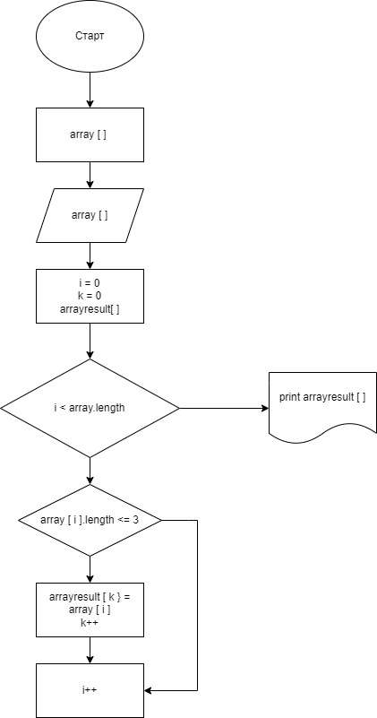

# Описание этапов выполнения проверочного задания #

***
**Проверочное задание предусматривает написание программы, которая из массива строк формирует массив из строк, длина которых меньше либо равна 3 символа.** 

**Пример:** 

[hello; 2; world; :-)] -> [2; :-)]
***

### 1. Для выполнения поставленной задачи составлена следующая блок-схема описывающая ход решения задачи

### 2. В соответствии с приведенной блок-схемой написана программа включающая следующую последовательность действий:
* первоначально массив строк вводиться пользователем;
* определяем длину массива;
* В цикле проходим по каждому элементу массива, проверяя выполнение заданного условия "длина элемента массива должна быть <=3";
* элементы первоначального массива, удовлетворяющие заданному условию переносим в новый результирующий массив; 
* выводим результирующий массив строк на экран.
